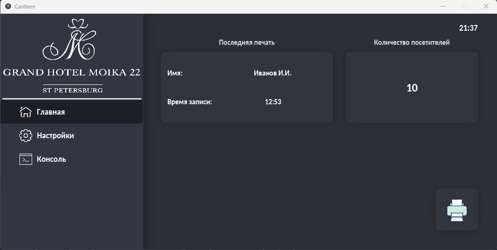
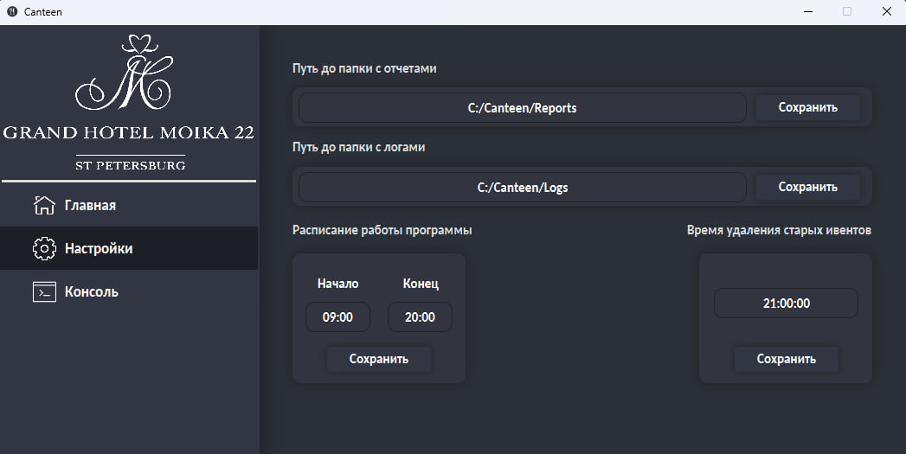

# Программа Canteen.

В рамках работы в отеле "Гранд Отель Мойка 22" была поставлена задача написать программу для печати чеков в столовой для сотрудников.

## Описание

Программа представляет собой небольшое Spring приложение, которое должно отлавливать прикладывние карточки сотрудника в столовой и печатать чек с его именем

**Требования к окружению и компонентам проекта:**

| Требования | Значения |
| --- | --- |
| Версия JDK | 18 | 
| Система контроля версий | git | 
| Версия Spring Boot |  2.2.4 |
| База Данных | FireBird 2.5 |
| Сборщик проекта | Maven | 

**Реализованные функции:**
+ Поиск новых записей в БД
+ Печать чеков для сотрудников
+ Система настроек приложения
+ Создание отчетов
    
## Скриншоты

**Основная страница**

**Страница настроек**

